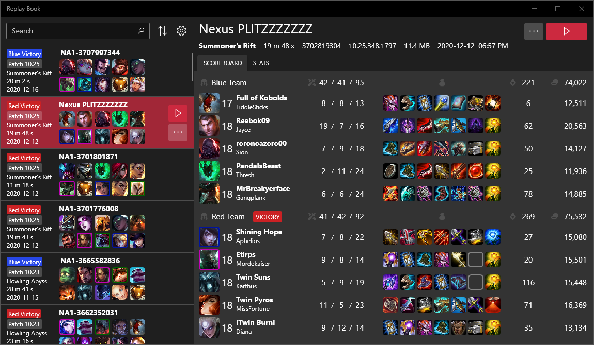

### ReplayBook is a free open-source tool that helps you organize and manage replays.

 

## ReplayBook is currently looking for **translators!** Please contact me if you are interested in helping!

## Join the Discord if you need help, or have any problems

## Features
* Keep old League of Legends patches and ReplayBook will automatically detect and match compatible replay files
* Assign player markers to easily spot players in the replay list
* View all information available in replay files
* Export data to CSV or JSON file formats
* Supports all regions!
* Windows 10 dark/light themes supported

## Getting Started
### YouTube Tutorial (coming soon)
### Tutorial
1. Get the latest release of ReplayBook ([download link](https://github.com/fraxiinus/ReplayBook/releases))
2. Extract the program and run ReplayBook.exe, you will be prompted with a first time setup.
3. Follow the on-screen instructions. It is *highly recommended* to download all images as it makes ReplayBook more responsive.
5. *(optional)* Add any other folders where you keep backups for old League of Legends versions by opening the settings window (Gear icon) ➡ Executables ➡ **Add** button under Executable Source Folders. Once you have added your folders, press the **Scan Folders** button and ReplayBook will automatically add your backups.
6. *(optional)* Add any other folders where you keep replay files by going to the settings menu (Gear icon), and adding folders under Replays ➡ Replay Source Folders.

## Troubleshooting
**Trying to play a replay causes a Bugsplat!**

Check that you have the Locale set correctly for your League of Legends install. If you game is in French, you need to tell ReplayBook by going to the settings (Gear icon) ➡ Executables ➡ Edit your executable under **Register Executables** and change the **Locale** value to your language.

**The application won't open**

Go to where you saved ReplayBook and delete the 'cache' folder. If that doesn't work try deleting appsettings.json and executablesettings.json. You will lose your settings, but may fix the problem.

**I accidentally deleted a replay within the program**

Files are only deleted when the window closes. If you accidentally deleted a file and didn't close ReplayBook, go to where ReplayBook is saved, open the 'cache' folder then the replay file should be in the 'deletedReplays' folder.