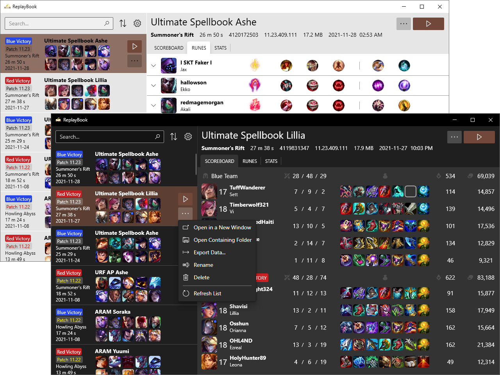

### ReplayBook is a free open-source tool that helps you organize and manage your downloaded replay files.

## [Download ReplayBook](https://github.com/fraxiinus/ReplayBook/releases/latest)

This project is currently looking for translators! [View the wiki for more information](https://github.com/fraxiinus/ReplayBook/wiki/Translating).

## Need help with ReplayBook?

Check out the [troubleshooting guide](https://github.com/fraxiinus/ReplayBook/wiki/Troubleshooting). If you'd like to contact someone, join the Discord or post in the project [discussions](https://github.com/fraxiinus/ReplayBook/discussions)

## Features

* Effortlessly play replay files
* Easily play expired replays by using League of Legends backups
* Assign player markers to easily spot players in the replay list
* View all information available in replay files, including runes!
* Export data to CSV or JSON file formats
* Supports all League of Legends regions!
* Community translated! Includes Simplified Chinese, French, German, Portuguese, and Spanish
* Windows 10 dark/light themes with accent color supported
* [See more/screenshots...](https://github.com/fraxiinus/ReplayBook/wiki/Features-and-Screenshots)

## Getting Started

### [YouTube Tutorial](https://youtu.be/mOpoyZuVyzs)

### Tutorial

1. Get the latest release of ReplayBook ([download link](https://github.com/fraxiinus/ReplayBook/releases))
2. Extract the program and run ReplayBook.exe, you will be prompted with a first time setup.
3. Follow the on-screen instructions. It is *highly recommended* to download all images as it makes ReplayBook more responsive.
4. *(optional)* Add any other folders where you keep backups for old League of Legends versions by opening the settings window (Gear icon) -> Executables -> **Add** button under Executable Source Folders. Once you have added your folders, press the **Scan Folders** button and ReplayBook will automatically add your backups.
5. *(optional)* Add any other folders where you keep replay files by going to the settings menu (Gear icon), and adding folders under Replays -> Replay Source Folders.

## Troubleshooting

**Playing replays causes a Bugsplat**

Check that you have the locale set correctly for your League of Legends executable. By default, ReplayBook uses the locale you selected during the setup process. If you game is in a different locale, you need to tell ReplayBook by going to the settings (Gear icon) -> Executables -> Edit your executable under `Register Executables` and change the `Locale` value to your language.

**Playing replays crashes with missing stub.dll**

In order to play replays, ReplayBook needs the entire League of Legends installation, not just `League of Legends.exe`. To make sure your installation is complete, you can try re-installing the game, or downloading someone else's backup.

[View full troubleshooting document](https://github.com/fraxiinus/ReplayBook/wiki/Troubleshooting)

## Building

### Requirements

* Visual Studio 2019
* .NET Framework v4.7.2
* Python 3+

### Steps

1. Open the provided solution file. Set **Rofl.UI.Main** as the startup project. Build the solution, but running it now will crash.
2. Run the provided `scripts/generate-runes.py` python script. This script will create the required rune data files in a new `runes` folder.
3. Copy the `runes` folder and all the contents to `Rofl.UI.Main\bin\Debug\lib`.
4. The solution will run successfully now.
