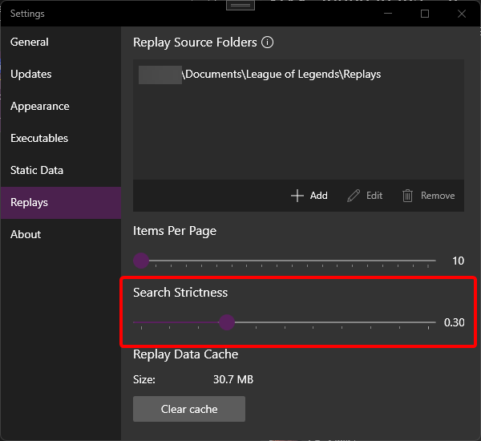

ReplayBook utilizes [Lucene.NET](https://lucenenet.apache.org/) for its search functionality.
The full query syntax can be found [here](https://lucenenet.apache.org/docs/4.8.0-beta00016/api/queryparser/Lucene.Net.QueryParsers.Classic.html).

## Example Queries

### Query player and champion

```plaintext
"wifienyabledcat Yuumi"
```

The quotes ensure that only replays where `wifienyabledcat` is playing `Yuumi` are returned.

Use the `AND` operator to query two players:

```plaintext
"wifienyabledcat Nami" AND Shavisi
```

And to specify champions:

```plaintext
"wifienyabledcat Yuumi" AND "Shavisi Zeri"
```

### Query matchups

Look for replays that have Nami against Senna:

```plaintext
(blue:Nami AND red:Senna) OR (red:Nami AND blue:Senna)
```

Player names can also be specified:

```plaintext
(blue:"Shavisi Nami" AND red:Senna) OR (red:"Shavisi Nami" AND blue:Senna)
```

Search only player matchups:

```plaintext
(blue:Shavisi AND red:Etirps) OR (red:Shavisi AND blue:Etirps)
```

### Range Queries

Fields can be queried over a range, this example returns all replays between the dates 2023-04-01 and 2023-04-29:

```plaintext
date:[20230401 TO 20230429]
```

Only return replays with a length between 10 minutes and 20 minutes:

```plaintext
length:[1000 TO 2000]
```

These of course can be combined with other queries, this example returns replays where wifienyabledcat is playing Milio in the month of April:

```plaintext
"wifienyabledcat milio" AND date:[20230401 TO 20230431]
```

## Available Fields

| Name         | Description                                                                                          | Example                                                                |
| ------------ | ---------------------------------------------------------------------------------------------------- | ---------------------------------------------------------------------- |
| baseKeywords | The default field used for basic searches - A comma separated list of all player names and champions | wifienyabledcat Nidalee, redmagemorgan Akali, Shining Hope Ezreal, ... |
| id           | The full file path of a replay - Only supports full text matches                                     | E:\User\Documents\League of Legends\Replays\NA1-999999.rofl            |
| red          | A comma separated list of player names and champions on the red team                                 | -                                                                      |
| blue         | A comma separated list of player names and champions on the blue team                                | -                                                                      |
| name         | The name of the replay - Used internally for sorting, only supports full text matching               | NA1-999999.rofl                                                        |
| date         | Replay file created date in (YEAR)(MONTH)(DAY) format                                                | 20230428                                                               |
| createdDate  | Replay file created date in ticks - Used internally for sorting, only supports full text matching    | 637618143631102168                                                     |
| fileSize     | Replay file size, in bytes - Used internally for sorting, only supports full text matching           | 16998400                                                               |
| length       | Game length in (Minutes)(Seconds) format                                                             | 2812                                                                   |

## Search Strictness

Search results are filtered by a score determined by how well it matches the query.
This filter can be adjusted to a lower value if the results are being constrained, or to a higher value if non-relevant results are returning.
The default value is 0.3.



---

## Need Help?

[Check the Troubleshooting page](../troubleshooting/index.md)

[Ask in GitHub :material-github:](https://github.com/fraxiinus/ReplayBook/discussions){ .md-button .md-button }
[Join the Discord :material-chat:](https://discord.gg/c33Rc5J){ .md-button .md-button }
[Report an Issue :material-bug:](https://github.com/fraxiinus/ReplayBook/issues/new/choose){ .md-button .md-button }
