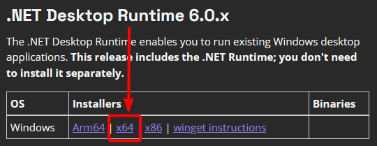

Thank you for downloading ReplayBook!

Click the button below to start your download.

[Download latest version](https://github.com/fraxiinus/replaybook/releases/latest/download/ReplayBook.zip){ .md-button .md-button--primary }
&nbsp;[Other versions](https://github.com/fraxiinus/ReplayBook/releases){ .md-button }

If you like what I do and would like to support me:

ReplayBook is completely ad-free and does not collect nor track user data.

## Quick Start

1. Extract the files from the zip archive  
    
2. Move the "ReplayBook" folder somewhere safe, like "Documents\Tools\ReplayBook"
3. Run "ReplayBook.exe" and follow the on-screen prompts  
    

!!! note
    Install [.NET Desktop Runtime 8.0.x (x64)](https://dotnet.microsoft.com/en-us/download/dotnet/8.0) if ReplayBook does not start.

    

Once ReplayBook is downloaded, you may want to check out the following section to take full advantage of all features:

[Setting up ReplayBook](../getting-started/setting-up-replaybook.md){ .md-button }

## Need Help?

[Check the Troubleshooting page](../troubleshooting/index.md)

[Ask in GitHub :material-github:](https://github.com/fraxiinus/ReplayBook/discussions){ .md-button .md-button }
[Join the Discord :material-chat:](https://discord.gg/c33Rc5J){ .md-button .md-button }
[Report an Issue :material-bug:](https://github.com/fraxiinus/ReplayBook/issues/new/choose){ .md-button .md-button }
