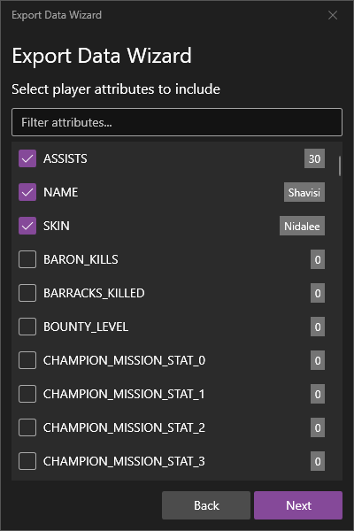
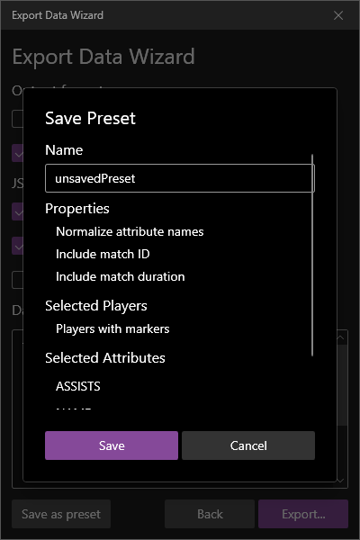
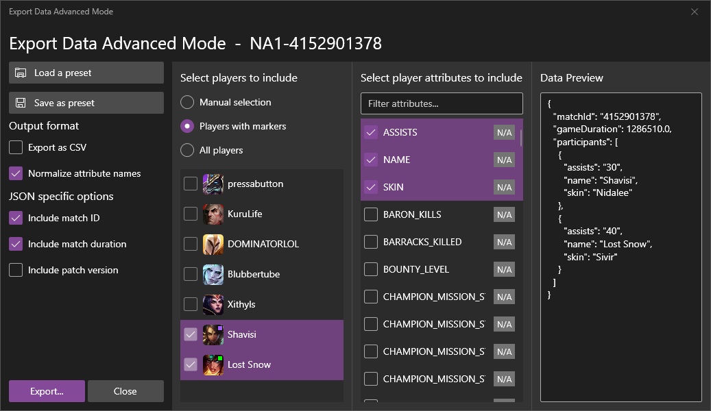

All readable data in a replay is available for exporting through ReplayBook.

!!! tip
    Exporting data from replays is one of the only ways of getting player data from custom games!

## Using the Export Data Wizard

Open the Export Data Wizard by right-clicking or clicking the three-dot 「More」 button on any replay.

### 1 - Select players

Click the 「Start wizard」 button. The next screen is where you select which players' data you want to export. You have the option of selecting players manually, only including those with [player markers](using-player-markers.md), or select all.

### 2 - Select attributes

After selecting your players, the next screen will ask you which attributes to export. Selected items are automatically sorted to the top of the list.

!!! warning
    Keep in mind that this list uses the **original attribute names** that are in the replay. Some things may be named strangely. For example, inhibitors are called 'Barracks' and the Nexus is called 'HQ'.

!!! note
    The square on the right of each item is a preview using the data one of the previously selected players.

### 3 - Final steps

On the last screen, you are given other options for the export as well as a data preview.

!!! note
    Some attributes can only be included if the output format is JSON. This is a limitation of the CSV format.

---

## Taking Advantage of Presets

Presets are a way to save a set of selected options that can be automatically applied. Players (including 'marker' and 'all' options), attributes, and all other options are included in a preset.

Create a preset by clicking the 「Save as preset」 button on the last screen of the Export Data Wizard. A prompt will appear containing a summary of the preset and a text box to input a name for the preset.

!!! note
    Presets are saved in the folder 'ReplayBook\cache\export_presets'

To use a preset, select the 「Export using preset」 option when exporting. A selection window will appear that will also preview the contents of preset. After selecting a preset, clicking the 「Load」 button will load the preset, apply it to the replay, and prompt you where to save the export data file.

---

## Using the Advanced Mode

The Export Data Wizard includes an **Advanced Mode**. This mode shows all exporter options on a single screen, making it ideal for power users. It also includes a live data preview if the window is resized wider to accommodate.

!!! note
    Loading a preset while in **Advanced Mode** does not immediately export the data. It simply applies the saved options.

---

[Next: Get static data bundles](../getting-started/get-static-data-bundles.md){ .md-button .md-button--primary }

---

## Table of available player properties

| Property Name | Description |
| --- | --- |
| ALL_IN_PINGS | |
| ASSISTS | |
| ASSIST_ME_PINGS | |
| ATAKHAN_KILLS | |
| BARON_KILLS | |
| BARRACKS_KILLED | Inhibitors killed |
| BARRACKS_TAKEDOWNS | inhibitor takedowns |
| BASIC_PINGS | |
| BOUNTY_LEVEL | |
| CHAMPIONS_KILLED | |
| CHAMPION_MISSION_STAT_0 | Unknown |
| CHAMPION_MISSION_STAT_1 | Unknown |
| CHAMPION_MISSION_STAT_2 | Unknown |
| CHAMPION_MISSION_STAT_3 | Unknown |
| CHAMPION_TRANSFORM | Unknown |
| COMMAND_PINGS | |
| CONSUMABLES_PURCHASED | |
| DANGER_PINGS | |
| DOUBLE_KILLS | |
| DRAGON_KILLS | |
| ENEMY_MISSING_PINGS | |
| ENEMY_VISION_PINGS | |
| EXP | Total experience earned |
| Event_2025LR_StructuresEpicMonsters | |
| FRIENDLY_DAMPEN_LOST | Unknown |
| FRIENDLY_HQ_LOST | Friendly Nexus lost |
| FRIENDLY_TURRET_LOST | |
| GAME_ENDED_IN_EARLY_SURRENDER | |
| GAME_ENDED_IN_SURRENDER | |
| GET_BACK_PINGS | |
| GOLD_EARNED | |
| GOLD_SPENT | |
| HOLD_PINGS | |
| HORDE_KILLS | Unknown |
| HQ_KILLED | Nexus killed |
| HQ_TAKEDOWNS | Nexus takedowns |
| ID | |
| INDIVIDUAL_POSITION | Lane position |
| ITEM0 | |
| ITEM1 | |
| ITEM2 | |
| ITEM3 | |
| ITEM4 | |
| ITEM5 | |
| ITEM6 | |
| ITEMS_PURCHASED | |
| KEYSTONE_ID | |
| KILLING_SPREES | |
| LARGEST_ABILITY_DAMAGE | |
| LARGEST_ATTACK_DAMAGE | |
| LARGEST_CRITICAL_STRIKE | |
| LARGEST_KILLING_SPREE | |
| LARGEST_MULTI_KILL | |
| LAST_TAKEDOWN_TIME | |
| LEVEL | |
| LONGEST_TIME_SPENT_LIVING | In seconds |
| MAGIC_DAMAGE_DEALT_PLAYER | |
| MAGIC_DAMAGE_DEALT_TO_CHAMPIONS | |
| MAGIC_DAMAGE_TAKEN | |
| MINIONS_KILLED | |
| MUTED_ALL | |
| Missions_CannonMinionsKilled | |
| Missions_ChampionTakedownsWhileGhosted | |
| Missions_ChampionTakedownsWithIgnite | |
| Missions_ChampionsHitWithAbilitiesEarlyGame | |
| Missions_ChampionsKilled | |
| Missions_CreepScore | |
| Missions_CreepScoreBy10Minutes | |
| Missions_Crepe_DamageDealtSpeedZone | |
| Missions_Crepe_SnowballLanded | |
| Missions_Crepe_TakedownsWithInhibBuff | |
| Missions_DamageToChampsWithItems | |
| Missions_DamageToStructures | |
| Missions_DestroyPlants | |
| Missions_DominationRune | |
| Missions_GoldFromStructuresDestroyed | |
| Missions_GoldFromTurretPlatesTaken | |
| Missions_GoldPerMinute | |
| Missions_HealingFromLevelObjects | |
| Missions_HexgatesUsed | |
| Missions_ImmobilizeChampions | |
| Missions_InspirationRune | |
| Missions_LegendaryItems | |
| Missions_MinionsKilled | |
| Missions_PeriodicDamage | |
| Missions_PlaceUsefulControlWards | |
| Missions_PlaceUsefulWards | |
| Missions_PorosFed | |
| Missions_PrecisionRune | |
| Missions_ResolveRune | |
| Missions_SnowballsHit | |
| Missions_SorceryRune | |
| Missions_TakedownBaronsElderDragons | |
| Missions_TakedownDragons | |
| Missions_TakedownEpicMonsters | |
| Missions_TakedownEpicMonstersSingleGame | |
| Missions_TakedownGold | |
| Missions_TakedownStructures | |
| Missions_TakedownWards | |
| Missions_TakedownsAfterExhausting | |
| Missions_TakedownsAfterTeleporting | |
| Missions_TakedownsBefore15Min | |
| Missions_TakedownsUnderTurret | |
| Missions_TakedownsWithHelpFromMonsters | |
| Missions_TotalGold | |
| Missions_TrueDamageToStructures | |
| Missions_TurretPlatesDestroyed | |
| Missions_TwoChampsKilledWithSameAbility | |
| Missions_VoidMitesSummoned | |
| NAME | Player name (unused) |
| NEED_VISION_PINGS | |
| NEUTRAL_MINIONS_KILLED | |
| NEUTRAL_MINIONS_KILLED_ENEMY_JUNGLE | |
| NEUTRAL_MINIONS_KILLED_YOUR_JUNGLE | |
| NODE_CAPTURE | Unknown |
| NODE_CAPTURE_ASSIST | Unknown |
| NODE_NEUTRALIZE | Unknown |
| NODE_NEUTRALIZE_ASSIST | Unknown |
| NUM_DEATHS | |
| OBJECTIVES_STOLEN | |
| OBJECTIVES_STOLEN_ASSISTS | |
| ON_MY_WAY_PINGS | |
| PENTA_KILLS | |
| PERK0 | Rune 0 Id |
| PERK0_VAR1 | |
| PERK0_VAR2 | |
| PERK0_VAR3 | |
| PERK1 | Rune 1 Id |
| PERK1_VAR1 | |
| PERK1_VAR2 | |
| PERK1_VAR3 | |
| PERK2 | Rune 2 Id |
| PERK2_VAR1 | |
| PERK2_VAR2 | |
| PERK2_VAR3 | |
| PERK3 | Rune 3 Id |
| PERK3_VAR1 | |
| PERK3_VAR2 | |
| PERK3_VAR3 | |
| PERK4 | Rune 4 Id |
| PERK4_VAR1 | |
| PERK4_VAR2 | |
| PERK4_VAR3 | |
| PERK5 | Rune 5 Id |
| PERK5_VAR1 | |
| PERK5_VAR2 | |
| PERK5_VAR3 | |
| PERK_PRIMARY_STYLE | |
| PERK_SUB_STYLE | |
| PHYSICAL_DAMAGE_DEALT_PLAYER | |
| PHYSICAL_DAMAGE_DEALT_TO_CHAMPIONS | |
| PHYSICAL_DAMAGE_TAKEN | |
| PING | Average(?) ping to server |
| PLAYERS_I_MUTED | |
| PLAYERS_THAT_MUTED_ME | |
| PLAYER_AUGMENT_1 | Unknown |
| PLAYER_AUGMENT_2 | Unknown |
| PLAYER_AUGMENT_3 | Unknown |
| PLAYER_AUGMENT_4 | Unknown |
| PLAYER_AUGMENT_5 | Unknown |
| PLAYER_AUGMENT_6 | Unknown |
| PLAYER_POSITION | |
| PLAYER_ROLE | |
| PLAYER_SCORE_0 | Unknown |
| PLAYER_SCORE_1 | Unknown |
| PLAYER_SCORE_10 | Unknown |
| PLAYER_SCORE_11 | Unknown |
| PLAYER_SCORE_2 | Unknown |
| PLAYER_SCORE_3 | Unknown |
| PLAYER_SCORE_4 | Unknown |
| PLAYER_SCORE_5 | Unknown |
| PLAYER_SCORE_6 | Unknown |
| PLAYER_SCORE_7 | Unknown |
| PLAYER_SCORE_8 | Unknown |
| PLAYER_SCORE_9 | Unknown |
| PLAYER_SUBTEAM | Unknown |
| PLAYER_SUBTEAM_PLACEMENT | Unknown |
| PUSH_PINGS | |
| PUUID | |
| QUADRA_KILLS | |
| RETREAT_PINGS | |
| RIFT_HERALD_KILLS | |
| RIOT_ID_GAME_NAME | |
| RIOT_ID_TAG_LINE | |
| SIGHT_WARDS_BOUGHT_IN_GAME | |
| SKIN | Name of champion |
| SPELL1_CAST | |
| SPELL2_CAST | |
| SPELL3_CAST | |
| SPELL4_CAST | |
| STAT_PERK_0 | Stat rune |
| STAT_PERK_1 | Stat rune |
| STAT_PERK_2 | Stat rune |
| SUMMONER_ID | |
| SUMMONER_SPELL_1 | |
| SUMMONER_SPELL_2 | |
| SUMMON_SPELL1_CAST | |
| SUMMON_SPELL2_CAST | |
| SeasonalMissions_TakedownAtakhan | |
| TEAM | |
| TEAM_EARLY_SURRENDERED | |
| TEAM_OBJECTIVE | |
| TEAM_POSITION | |
| TIME_CCING_OTHERS | Seconds |
| TIME_OF_FROM_LAST_DISCONNECT | Seconds |
| TIME_PLAYED | |
| TIME_SPENT_DISCONNECTED | Seconds |
| TOTAL_DAMAGE_DEALT | |
| TOTAL_DAMAGE_DEALT_TO_BUILDINGS | |
| TOTAL_DAMAGE_DEALT_TO_CHAMPIONS | |
| TOTAL_DAMAGE_DEALT_TO_OBJECTIVES | |
| TOTAL_DAMAGE_DEALT_TO_TURRETS | |
| TOTAL_DAMAGE_SELF_MITIGATED | |
| TOTAL_DAMAGE_SHIELDED_ON_TEAMMATES | |
| TOTAL_DAMAGE_TAKEN | |
| TOTAL_HEAL | |
| TOTAL_HEAL_ON_TEAMMATES | |
| TOTAL_TIME_CROWD_CONTROL_DEALT | |
| TOTAL_TIME_CROWD_CONTROL_DEALT_TO_CHAMPIONS | |
| TOTAL_TIME_SPENT_DEAD | |
| TOTAL_UNITS_HEALED | |
| TRIPLE_KILLS | |
| TRUE_DAMAGE_DEALT_PLAYER | |
| TRUE_DAMAGE_DEALT_TO_CHAMPIONS | |
| TRUE_DAMAGE_TAKEN | |
| TURRETS_KILLED | |
| TURRET_TAKEDOWNS | |
| UNREAL_KILLS | |
| VICTORY_POINT_TOTAL | Unknown |
| VISION_CLEARED_PINGS | |
| VISION_SCORE | |
| VISION_WARDS_BOUGHT_IN_GAME | |
| WARD_KILLED | |
| WARD_PLACED | |
| WARD_PLACED_DETECTOR | Pink (red) wards |
| WAS_AFK | |
| WAS_AFK_AFTER_FAILED_SURRENDER | |
| WAS_EARLY_SURRENDER_ACCOMPLICE | |
| WAS_LEAVER | |
| WAS_SURRENDER_DUE_TO_AFK | |
| WIN | |

## Need Help?

[Check the Troubleshooting page](../troubleshooting/index.md)

[Ask in GitHub :material-github:](https://github.com/fraxiinus/ReplayBook/discussions){ .md-button .md-button }
[Join the Discord :material-chat:](https://discord.gg/c33Rc5J){ .md-button .md-button }
[Report an Issue :material-bug:](https://github.com/fraxiinus/ReplayBook/issues/new/choose){ .md-button .md-button }
