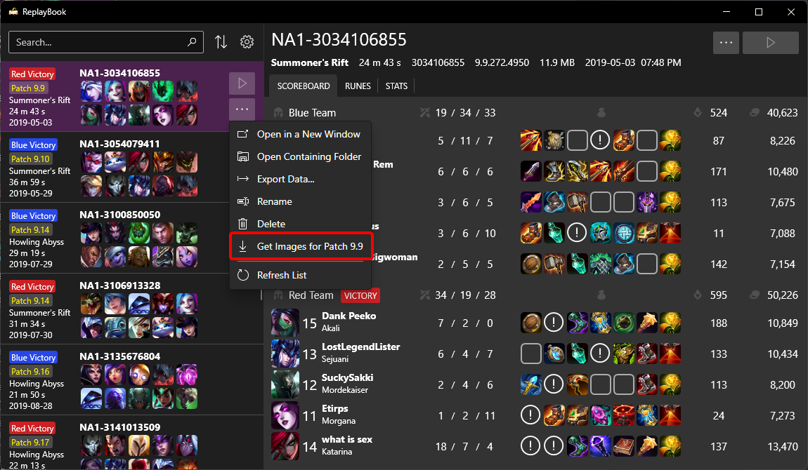
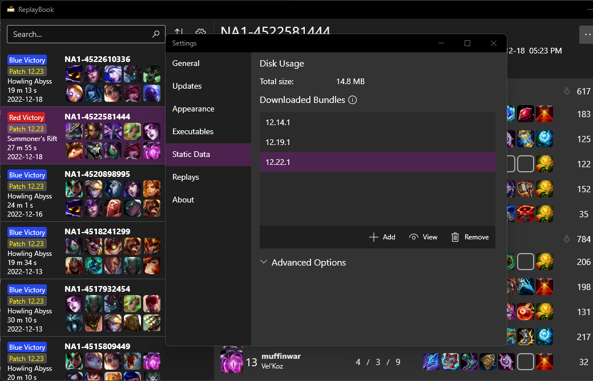
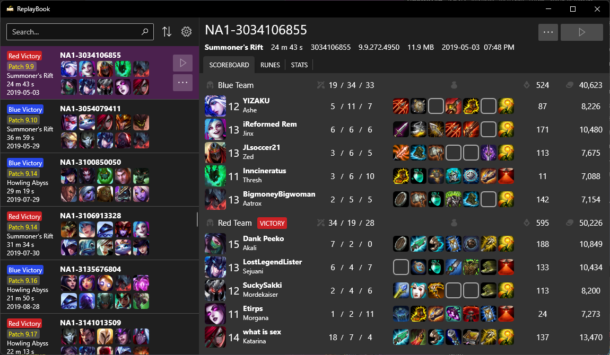

A Static Data Bundle is a collection of images and miscellaneous text that ReplayBook uses to display replay files. It contains champion, item, and rune thumbnails as well as correct champion and rune names and descriptions.

You can download multiple bundles to display replays that have removed items or reworked champions correctly.

By default, the [setup wizard](setting-up-replaybook.md) downloads the bundle for the last most recent patch.

!!! tip
    When displaying replays, ReplayBook automatically chooses the bundle that is the closest version to the replay.

## Download Bundles

### Option 1

Download a bundle for a specific replay by right-clicking or clicking the three-dot 「More」 button when the replay is selected.

### Option 2

Go to 「Settings」 (gear icon) -> 「Static Data」 page. Here you will see all information regarding static data in ReplayBook. Then press 「Add」and select the bundle to download.

### Fixed result

Notice how pre-reworked Mordekaiser is now displayed correctly, and all the items that had trouble displaying previous are now fixed.

---

[Next: Advanced search techniques](../getting-started/advanced-search-techniques.md){ .md-button .md-button--primary }

---

## Need Help?

[Check the Troubleshooting page](../troubleshooting/index.md)

[Ask in GitHub :material-github:](https://github.com/fraxiinus/ReplayBook/discussions){ .md-button .md-button }
[Join the Discord :material-chat:](https://discord.gg/c33Rc5J){ .md-button .md-button }
[Report an Issue :material-bug:](https://github.com/fraxiinus/ReplayBook/issues/new/choose){ .md-button .md-button }
