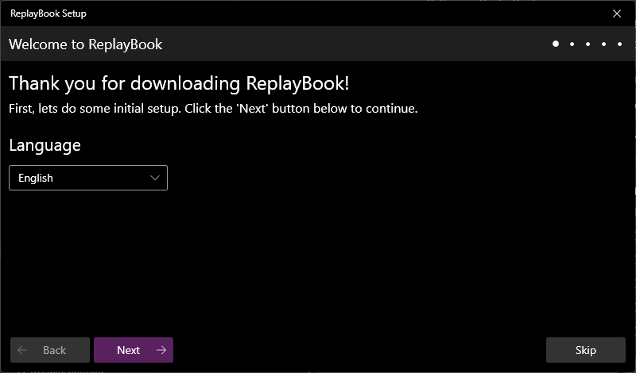
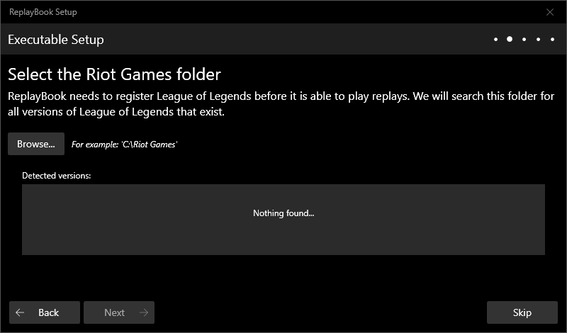
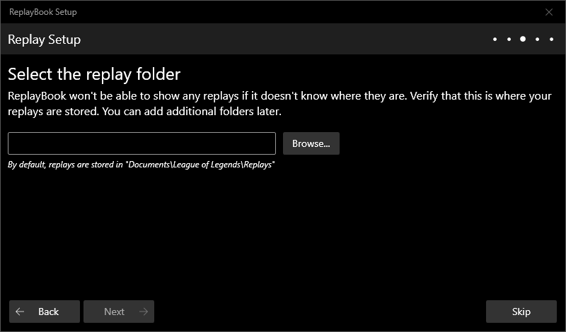
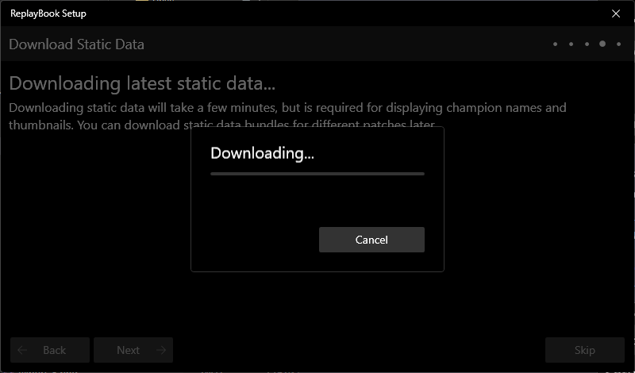
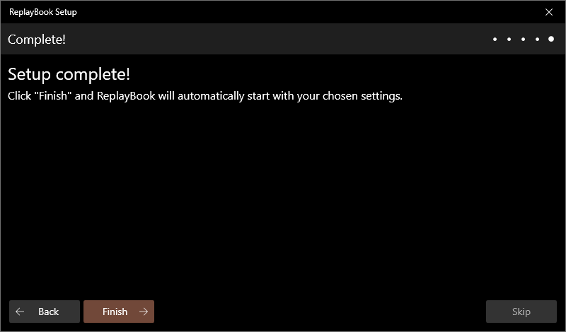

## First Time Setup

### 1 - Choose a language

The first time you launch ReplayBook, you will be greeted with the **Welcome Setup Window**. Choose your preferred language and click 「Next」.

### 2 - Register League of Legends

In this screen, select where you installed League of Legends. This is what allows ReplayBook to play replays. The default location for the Riot Games folder would be something like "C:\Riot Games".

!!! note

    If nothing shows up in the **Detected versions** box, double check to make sure you selected the correct folder.
    If you have a backup folder with multiple installations, the screen will search and add all detected versions.

!!! warning

    If you skip this step, ReplayBook will be unable to play replays until you register League of Legends manually.

### 3 - Add a replay folder

Click the 「Browse」 button and select where replays are saved on your computer. The default folder used by the League of Legends client would be something like "C:\Users\username\Documents\League of Legends\Replays"

!!! warning

    If you skip this step, ReplayBook will not be able to display any replays. You can always add more replay folders later.

### 4 - Download static data bundle

ReplayBook will now perform a download for all images and data (static data bundle) needed to display replays. If you choose to skip this step, you will need to download static data bundles later.

### 5 - Finished

That is it! With that, the basic setup for ReplayBook is complete. Click 「Finish」 and ReplayBook will open.

!!! note
    If you ever need to repeat this setup process, delete the file "ReplayBook\cache\SKIPWELCOME".

---

## Open .ROFL files by default

By default, you need to manually enable .ROFL file associations.

1. Go to 「Settings」 (gear icon) -> 「General」 page
2. Click the 「Set .ROFL file association」 button
3. Verify the association by double-clicking a .ROFL file in Explorer

!!! note
    You can also choose the default behavior for opening .ROFL files in Explorer. ReplayBook can either play the replay immediately, or show the replay's information.

---

[Next: Using player markers](../getting-started/using-player-markers.md){ .md-button .md-button--primary }

---

## Need Help?

[Check the Troubleshooting page](../troubleshooting/index.md)

[Ask in GitHub :material-github:](https://github.com/fraxiinus/ReplayBook/discussions){ .md-button .md-button }
[Join the Discord :material-chat:](https://discord.gg/c33Rc5J){ .md-button .md-button }
[Report an Issue :material-bug:](https://github.com/fraxiinus/ReplayBook/issues/new/choose){ .md-button .md-button }
