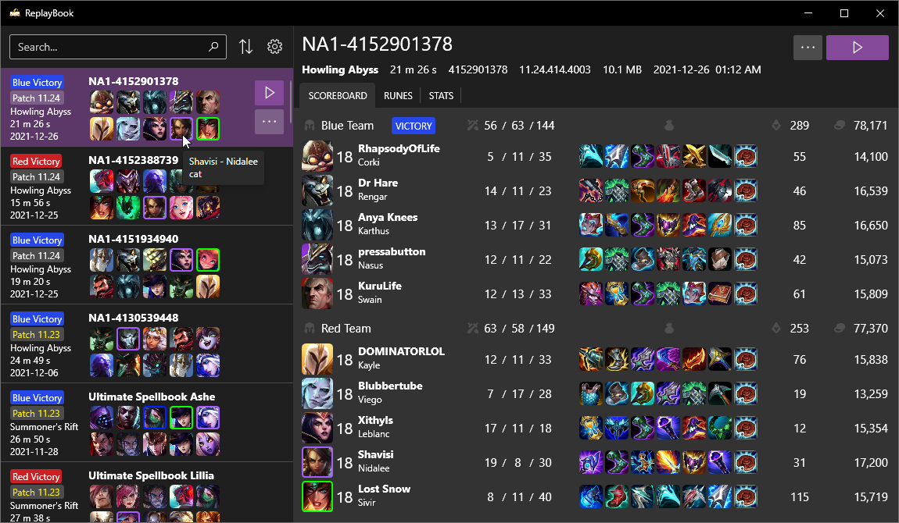
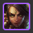
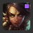

**Player Markers** allow you to save players of interest so that they can be easily identified in the user interface. Simply add the username of the player, and every occurrence of that player will be marked with a color. Marker colors are customizable, and notes can be added. Notes are visible when hovering over a player portrait with a mark.

## Adding or Editing Markers

Open the **Settings Window** by clicking the gear icon next to the sort button. Then navigate to the 「General」 settings tab.

Here you can add new markers, make changes to existing ones, or delete markers you no longer want. Double-clicking an entry in the list will open the entry for editing.

---

## Marker Styles

There are currently two options for marker style: **Border around** or **Square inside**. This option changes where the color is placed in the player portrait.

| Border around (default) | Square inside |
| --- | --- |
|  |  |

---

## Use Case Examples

* Add your friends so you can quickly see who was playing with you.
* If you are a coach, you can add your players so you can easily see what champions they are playing.
* Add entire teams under one color, so you can follow team match-ups easily.

---

[Next: Playing expired replays](../getting-started/playing-expired-replays.md){ .md-button .md-button--primary }

---

## Need Help?

[Check the Troubleshooting page](../troubleshooting/index.md)

[Ask in GitHub :material-github:](https://github.com/fraxiinus/ReplayBook/discussions){ .md-button .md-button }
[Join the Discord :material-chat:](https://discord.gg/c33Rc5J){ .md-button .md-button }
[Report an Issue :material-bug:](https://github.com/fraxiinus/ReplayBook/issues/new/choose){ .md-button .md-button }
