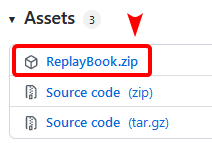
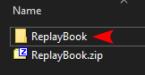
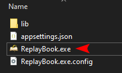

# Download ReplayBook

Thank you for downloading ReplayBook!

1. Go to the [GitHub releases page](https://github.com/fraxiinus/ReplayBook/releases/latest)
2. Download **ReplayBook.zip** from the **Assets** section  
   
3. Extract the files from the zip archive  
   
4. Move the **ReplayBook** folder somewhere safe, like 'Documents\Tools\ReplayBook'
5. Run **ReplayBook.exe** and follow the on-screen prompts  
   
6. Install [.NET Desktop Runtime 6.0.x (x64)](https://dotnet.microsoft.com/en-us/download/dotnet/6.0) if ReplayBook does not start.

Check out the [Getting Started](../tutorial/0_landing.md) page!
