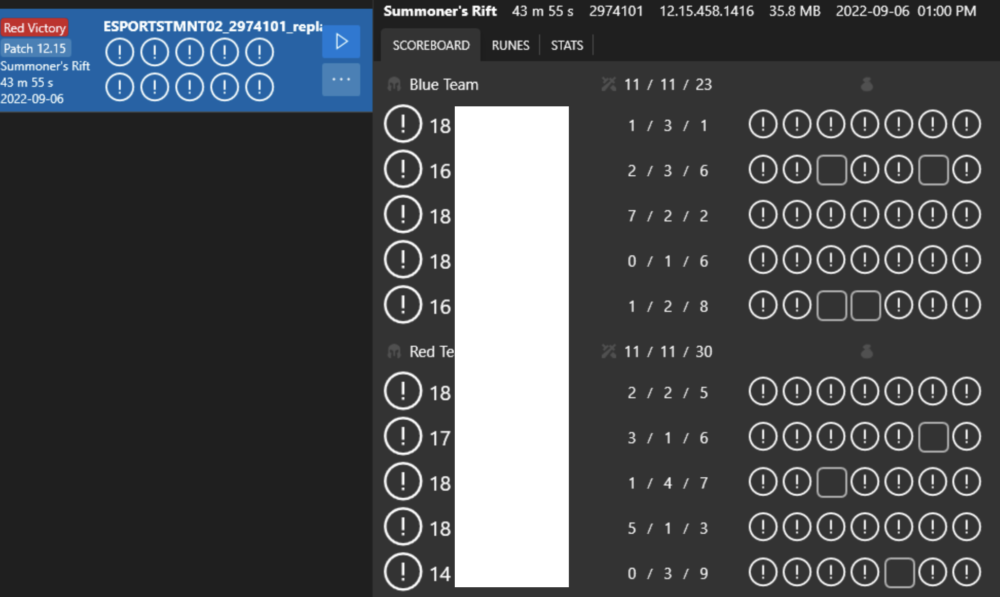

Check if you have any **static data bundles** downloaded. Bundles are required for ReplayBook to display images correctly.

Right click the replay that is having image issues, and click 「Get Images for Patch XX.XX」. ReplayBook will download the appropriate bundle and the images should now display properly.

[Learn more about Static Data Bundles](../getting-started/get-static-data-bundles.md)

---

## Need Additional Help?

[Ask in GitHub :material-github:](https://github.com/fraxiinus/ReplayBook/discussions){ .md-button .md-button }
[Join the Discord :material-chat:](https://discord.gg/c33Rc5J){ .md-button .md-button }
[Report an Issue :material-bug:](https://github.com/fraxiinus/ReplayBook/issues/new/choose){ .md-button .md-button }
