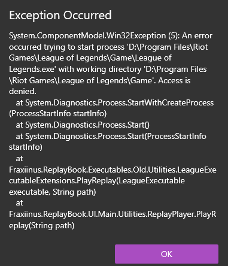

There are a lot of potential issues that can cause issues. Check if the issue you are having matches any of these descriptions.

## Access Denied before replay launches

This occurs due to Riot Vanguard preventing anything from accessing the League of Legends executable. Vanguard must be disabled before ReplayBook will be able to launch replays. ReplayBook attempts to disable Vanguard automatically, but sometimes it doesn't work.

If disabling Vanguard from the tray icon does not work, or if you do not have access to the tray icon, try using the following script.

[NoMoreVanguard by Vudgekek](https://github.com/Vudgekek/NoMoreVanguard)

## Incorrect Locale

An incorrect **locale** can cause bugsplat errors and text issues.

Check that you have the **locale** set correctly for your League of Legends executable. By default, ReplayBook tries its best to detect the correct locale. If you game is in a different locale, you need to tell ReplayBook:

### How to change an executable's locale

1. Go to 「Settings」 (gear icon) -> 「Executables」 -> 「Edit」 your executable under **Registered Executables**
2. Correct the **Locale** value.

!!! note
    If you downloaded a backup from replays.xyz, change the locale to 'EnglishUS (en_US)'

---

## Playing Replays Crashes With Missing stub.dll

In order to play replays, **ReplayBook needs the entire League of Legends installation, not just League of Legends.exe**. To make sure your installation is complete, you can try re-installing the game, or downloading someone else's backup.

---

## Playing Replays Crashes With Critical Error

The following steps will walk you through checking common problems when using League of Legends backups:

1. Is your executable locale set correctly? Check [these instructions](#how-to-change-an-executables-locale)
2. If you are using a backup downloaded online, try extracting the download into a new empty folder and try ReplayBook again. You may have accidentally lost a few files during extractions.
3. If that doesn't work, maybe the download failed. Try downloading the file again, or try a difference source.

!!! note
    This error usually occurs when the League of Legends installation is missing critical files.

---

## League of Legends "Failed to open replay. The game will now exit." Error

This is a generic error from League of Legends that indicate something is wrong with the installation. Check the following:

1. Does your Windows username have accent marks (for example: â, ê, ô) or any other special characters?  
If you do, you will need to rename your Windows user folder, or create a new user that does not have any accent marks in the name.
2. Is the replay file corrupted? Try giving it to someone else and see if they can play it successfully.
3. Is the League of Legends installation incomplete? Try using a backup from replays.xyz and see if it works.

---

## Need Additional Help?

[Ask in GitHub :material-github:](https://github.com/fraxiinus/ReplayBook/discussions){ .md-button .md-button }
[Join the Discord :material-chat:](https://discord.gg/c33Rc5J){ .md-button .md-button }
[Report an Issue :material-bug:](https://github.com/fraxiinus/ReplayBook/issues/new/choose){ .md-button .md-button }
