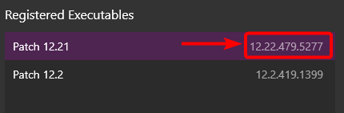

# Play Button is Disabled

Make sure you have registered your installation(s) of League of Legends with ReplayBook. In order to play a replay from an old patch, you need a copy of that exact patch on your computer. If you do not have a backup, try looking for a download online, or from someone you know.

!!! warning
    Double check if you really have a patch. In the "Registered Executables" list, each item has the name on the left and the patch on the right. You might have a situation where the executable is named "Patch 10.22" but the actual patch version is something else.

    

[Learn more about playing expired replays](../getting-started/playing-expired-replays.md)

---

## Need Additional Help?

[Ask in GitHub :material-github:](https://github.com/fraxiinus/ReplayBook/discussions){ .md-button .md-button }
[Join the Discord :material-chat:](https://discord.gg/c33Rc5J){ .md-button .md-button }
[Report an Issue :material-bug:](https://github.com/fraxiinus/ReplayBook/issues/new/choose){ .md-button .md-button }
