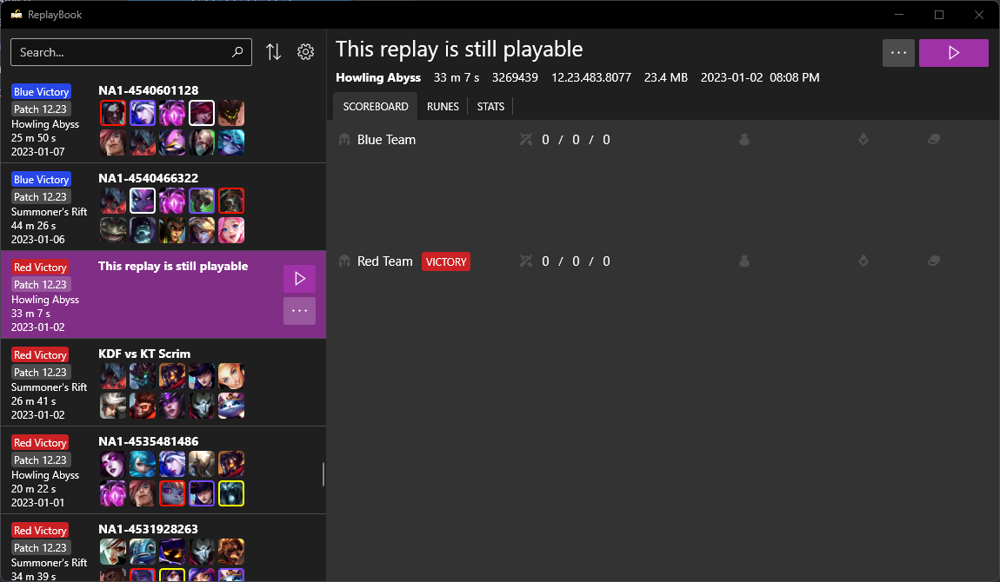
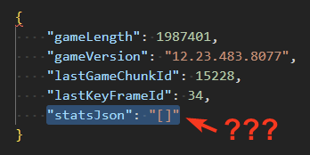

**There is no known method of fixing replays that are in this state.**

The replay file is missing the entire data block that ReplayBook relies on for information. The replay is still playable, however previews and [the exporter](../getting-started/exporting-player-data.md) will not be able to get any data.

This seems to happen when all players of the game leave the game by using Alt-F4 before the nexus is destroyed. This seems to cancel the game on the server thus leaving no data behind. **Please stay in the game as long as possible to prevent this from happening.**

---

## Need Additional Help?

[Ask in GitHub :material-github:](https://github.com/fraxiinus/ReplayBook/discussions){ .md-button .md-button }
[Join the Discord :material-chat:](https://discord.gg/c33Rc5J){ .md-button .md-button }
[Report an Issue :material-bug:](https://github.com/fraxiinus/ReplayBook/issues/new/choose){ .md-button .md-button }
