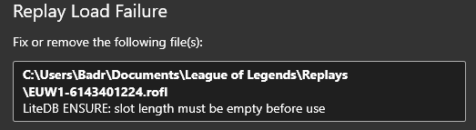
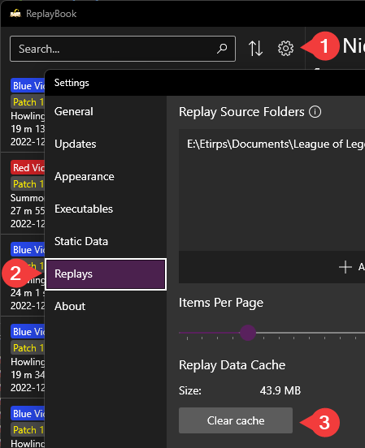

## No Replay Folders

Make sure you have your replay folder added to ReplayBook. Otherwise the the program won't know where to look.

!!! note
    The default location for replays is "C:\Users\username\Documents\League of Legends\Replays".

### How to add a replay folder

1. Go to 「Settings」 (gear icon) -> 「Replays」 -> 「Add」 button under "Replay Source Folders".
2. Close the settings window and ReplayBook will search your newly added folder.

---

## Replay Load Failure

This error is displayed when ReplayBook encounters a replay that it was not able to read. The replay might be corrupted, try downloading it again.

If the error includes the description "LiteDB ENSURE", clearing the replay cache may resolve the issue.

### How to clear replay cache

1. Go to 「Settings」 (gear icon) -> 「Replays」 -> 「Clear cache」 button under "Replay Data Cache".
2. Restart ReplayBook.

---

## Need Additional Help?

[Ask in GitHub :material-github:](https://github.com/fraxiinus/ReplayBook/discussions){ .md-button .md-button }
[Join the Discord :material-chat:](https://discord.gg/c33Rc5J){ .md-button .md-button }
[Report an Issue :material-bug:](https://github.com/fraxiinus/ReplayBook/issues/new/choose){ .md-button .md-button }
