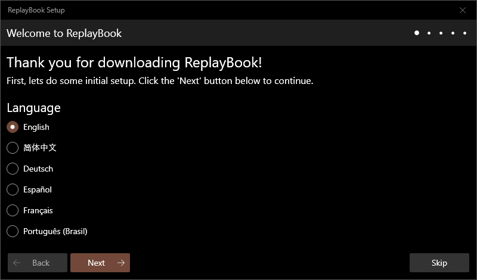
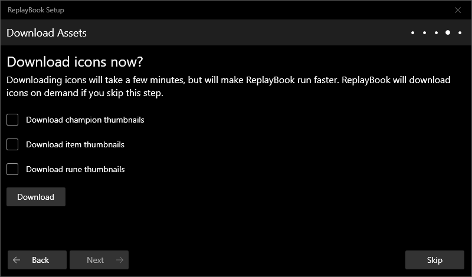
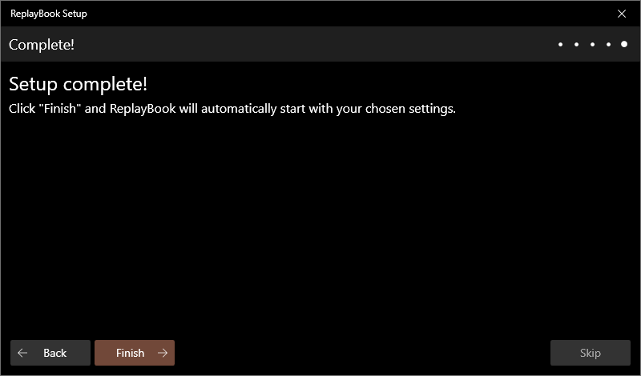

# Setting Up ReplayBook

Previous Page << [Table of Contents](0_landing.md)

## First Time Setup

The first time you launch ReplayBook, you will be greeted with the **Welcome Setup Window**. Choose your preferred language and click **Next**.

In this screen, select where you installed League of Legends. This is what allows ReplayBook to play replays. The default location for the Riot Games folder would be something like "C:\Riot Games".

> If nothing shows up in the **Detected versions** box, double check to make sure you selected the correct folder.

> If you have a backup folder with multiple installations, the screen will search and add all detected versions.

Continue to the next step when ready.

Click the **Browse** button and select where replays are saved on your computer. The default folder used by the League of Legends client would be something like "C:\Users\username\Documents\League of Legends\Replays"

You can always add more replay folders later.

You can choose to download all image assets now. This improves performance, but takes a few minutes, even with fast internet. If you choose to skip this step, ReplayBook will download images when it needs them, much like a web browser.

That is it! With that, the basic setup for ReplayBook is complete. Click **Finish** and ReplayBook will open.

> If you ever need to repeat this setup process, delete the file "ReplayBook\cache\SKIPWELCOME".

## How to Associate .ROFL Files with ReplayBook

By default, you need to manually enable .ROFL file associations.

1. Go to **Settings** (gear icon) -> **General** page
2. Click the **Set .ROFL file association** button
3. Verify the association by double-clicking a .ROFL file in Explorer

> You can also choose the default behavior for opening .ROFL files in Explorer. ReplayBook can either play the replay immediately, or show the replay's information.

## Need Additional Help?

[Check out the Common Problems and Solutions page](../pages/common_problems.md),  
[Ask about it in the GitHub Discussions page](https://github.com/fraxiinus/ReplayBook/discussions),  
[Or ask in the developer Discord](https://discord.gg/c33Rc5J).  
[Report an issue with this page](https://github.com/fraxiinus/ReplayBook/issues/new/choose).

Next Page >> [Using Player Markers](2_markers.md)
